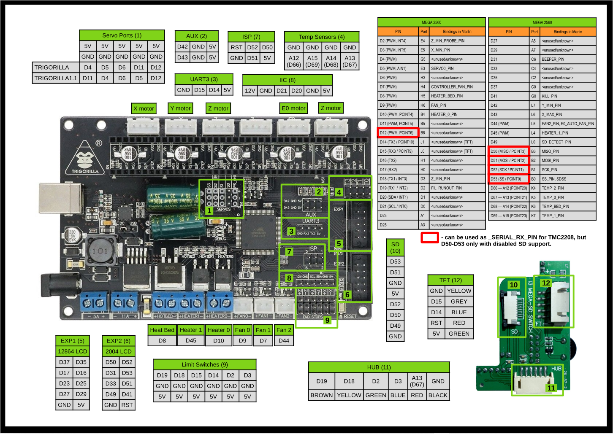

# Anycubic Kossel Klipper FW configuration

This is my attempt to improve the power of my old Delta style 3D printer.

Most of configuration is "copy & paste" from multiple reference sources.

## Model

- Anycubic Kossel Linear Plus
- Raspberry Pi 3B
- Octopi 0.18.0 / Octoprint 1.7.2
  - Plugins:
    - OctoKlipper 0.3.9.4
- Klipper 3D FW O.10.0-172-g051133f8

## References

- [Official Configuration Sample](https://github.com/Klipper3d/klipper/blob/master/config/printer-anycubic-kossel-plus-2017.cfg)
- [Official Delta Style Configuration Reference](https://www.klipper3d.org/Config_Reference.html#linear-delta-kinematics)
- [Lukas Pomykal](https://www.lpomykal.cz/anycubic-kossel-klipper-configuration/)
- [Trigorilla Pins Source](https://cdn.thingiverse.com/assets/32/8c/6d/ab/5b/TriGoRiLLa_PINs.pdf)
- [Reddit](https://www.reddit.com/r/3Dprinting/comments/annkph/mks_14_from_a4988_to_tmc2208_stepper_motor/)

## Usage

- Make sure you know your hardware
  - Please read the `Importance Notes` below before any usage
- Use a secure transfer command like `scp` (which is available for most of OS platform nowadays). Otherwise, use any tool you are familiar with to transfer the file from your machine to the `octopi` machine's `/home/pi` directory. Example:

  ```shell
  scp ./printer.cfg pi@octopi.local:/home/pi
  ```

- I assume you are using the default setting of `octopi`, if you have different user account settup, the directory will be `/home/{username}`
- Make sure you calibrate before any first print

## Important Notes

- The current configuration targets:
  - the `type 2` probe
  - `TMC2208` driver
    - To use `A4988` driver, just:
      - remove these `[tmc2208 stepper_'x']` settings
      - append `!` prior to value of `dir_pin` key at each `[stepper_'x']` configurations to invert direction
  - Trigorilla board v1.1
    - You can find the version printed next to the name on the board surface
- Be aware of the physical dimensions of the machine:
  - `heat bed size`:
    - The stock bed is 230mm in diameter
      - => radius 115mm
    - The ultrabase has 2 versions:
      - 200mm => radius 100mm
      - 240mm => radius 200mm
- The direction on `TMC2208` is reversed compared to `A4988`. (That's why we use `!` as claimed above)
  > This seems to be intentional and is documented even in the comments on Amazon listings.
- Trigorilla pins (both 1.0 and 1.1)
  > 

## Known Errors and Solutions

### At installing Klipper to Raspberry Pi

```shell
E: Repository 'http://archive.raspberrypi.org/debian buster InRelease' changed its 'Suite' value from 'testing' to 'oldstable'
N: This must be accepted explicitly before updates for this repository can be applied. See apt-secure(8) manpage for details.
```

Solutution:
> Run several times this command until no error

```shell
apt-get --allow-releaseinfo-change update
```

### At compiling Klipper with `make` command

```shell
src/i2ccmds.c:14:23: error: field ‘i2c_config’ has incomplete type
     struct i2c_config i2c_config;
```

Solution:
> Just clean and redo

```shell
make clean
make menuconfig
make
```
